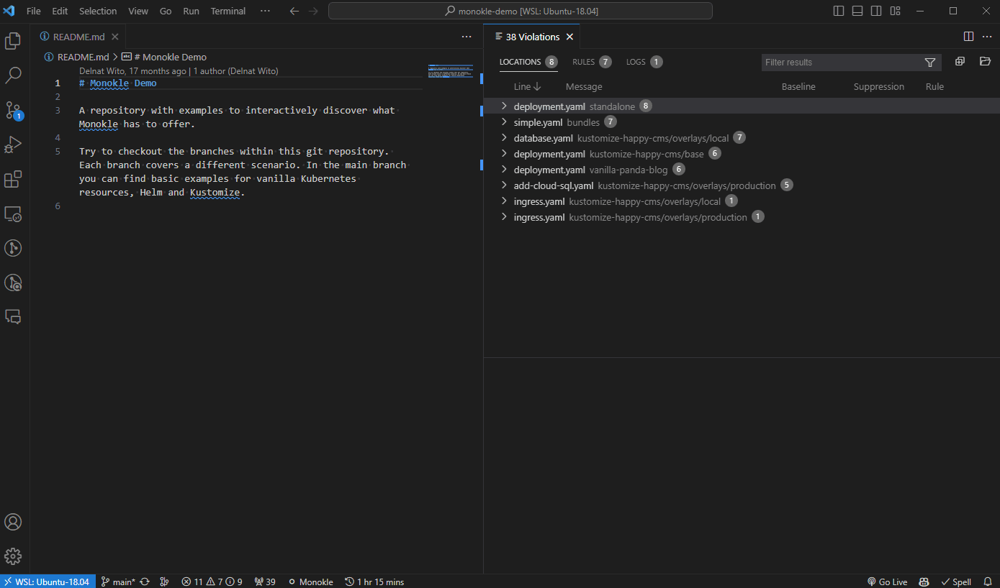
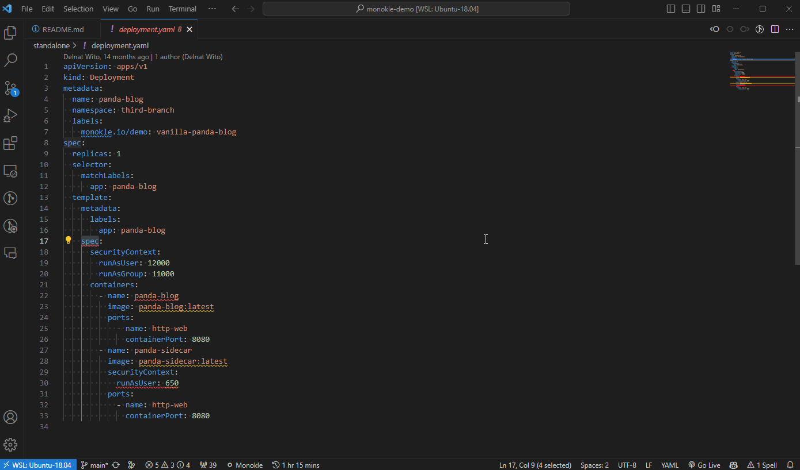
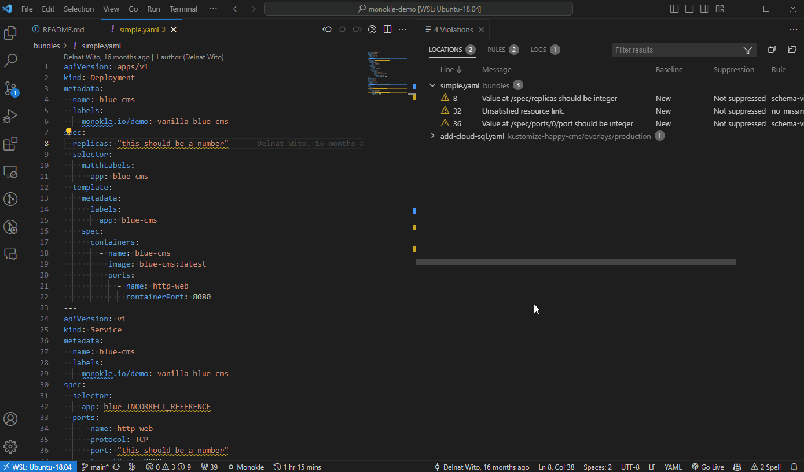
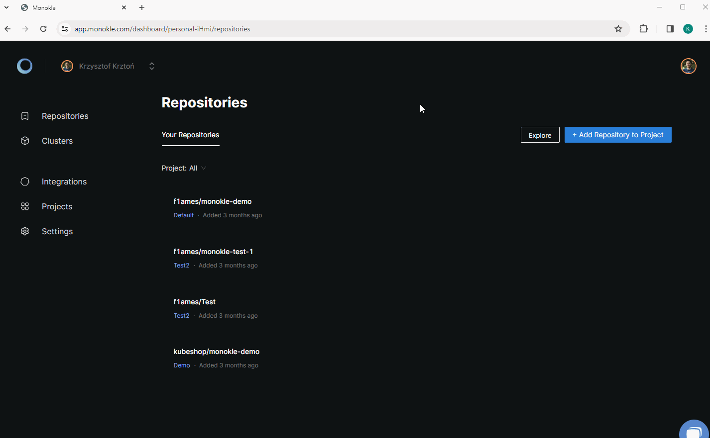
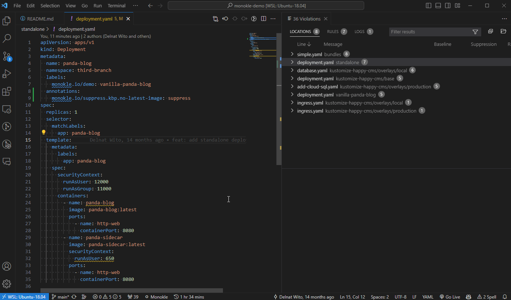
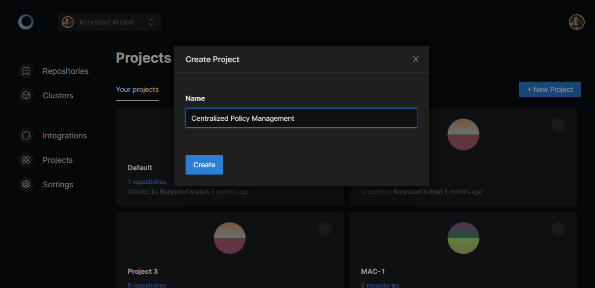
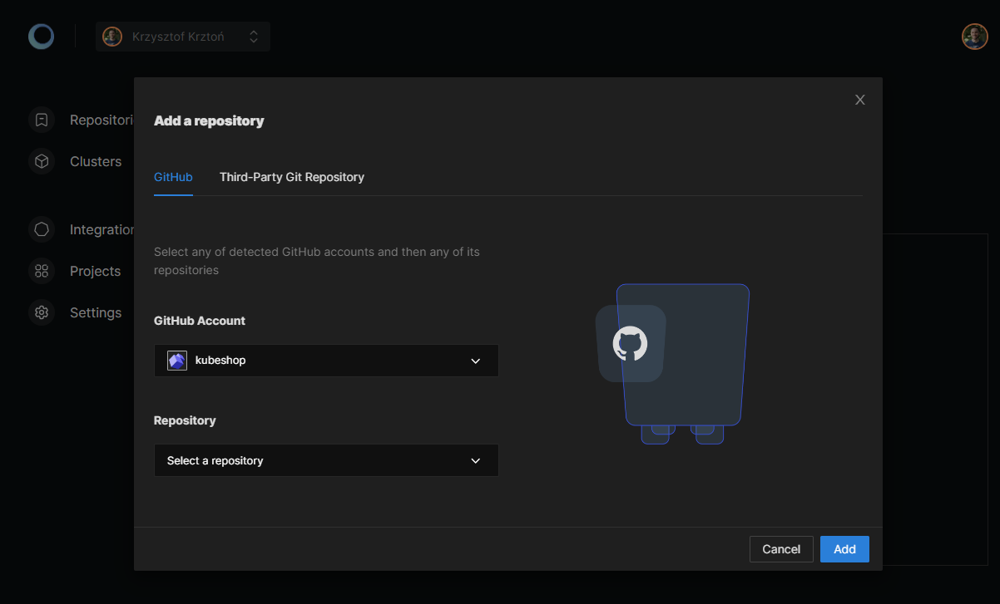
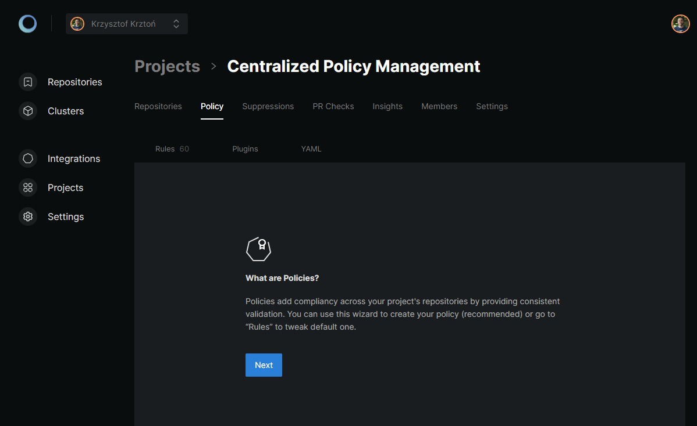

# Monokle VSC Extension

  
  
  

Monokle Visual Studio Code extensions let's you validate your Kubernetes resources directly in Visual Studio Code. It is a great complement to [Monokle Cloud](https://monokle.io), [Desktop](https://monokle.io/open-source) or [CLI](https://github.com/kubeshop/monokle-cli).

Monokle aims to help you write better Kubernetes deployments no matter your preferred way of working. You can now install our extension to fix your configuration directly while you are coding from the comfort of your Visual Studio Code.

As usual, misconfigurations are highlighted directly within your source code with a recommended remediation to fix them without being a Kubernetes expert. All misconfigurations are also listed as a summary in VSCode's problem pane, or within the SARIF viewer for additional information and filters.

By default, a [sensible policy](#default-validation-configuration) is used, or you can simply add a Monokle [validation configuration file](https://github.com/kubeshop/monokle-core/blob/main/packages/validation/docs/configuration.md) to your workspace to customize the rules.

This is **Technical Preview** release. We are open to any feedback and eager to improve the product together with our users and community. Feel free to drop us any questions, feature proposals and issues.

## Features

### Easily navigate through all errors and resources

Monokle validation panel allows you to easily see all validation errors grouped by resource or rule id, see each rule details and navigate to exact line in each resource where violation was detected.

  

### See violations in `Problems` tab for opened resources

When navigating through resource files, you can see all violations in VSC build-in `Problems` tab.

  

### Get instant feedback on fixes

Validation runs in a background every time a file is modified and saved. This way you get instant feedback when applying fixes.

  

### Adjust to your needs

With dedicated `Monokle: Bootstrap configuration` command, you can customize validation configuration in seconds and adjust to your specific needs.

  

### Enforce policies with Monokle Cloud

Quickly define and manage polices in Monokle Cloud which will be used for anyone working with the project in VSC.

#### Configure policies easily with Monokle Cloud

  

#### Synchronizes automatically and with single command

  

See [**Monokle Cloud integration setup** section](#monokle-cloud-integration-setup) below on how to configure it.

### Runs with commands

Use command palette to interact with extension, run validation, see current configuration and more.

* `Monokle: Validate` - runs validation of Kubernetes resources on demand.
* `Monokle: Synchronize` - synchronizes remote policy from Monokle Cloud.
* `Monokle: Login` - logins to Monokle Cloud.
* `Monokle: Logout` - logouts from Monokle Cloud.
* `Monokle: Show validation panel` - opens validation panel (this can be also done be clicking on Monokle status bar icon).
* `Monokle: Show configuration` - opens validation configuration file which is used as validation configuration for given project.
* `Monokle: Bootstrap configuration` - creates `monokle.validation.yaml` configuration file. It is a quick way to adjust validation config.

## Default Validation Policy

The default configuration used for resource validation enables the following validation plugins:
- **Pod Security Standard** validation, based on the corresponding standard from the Kubernetes project.
- **Kubernetes Schema** validation for checking schema and Kubernetes version compliance.
- **Resource Links** validation to ensure that all references between resources are valid.
- **YAML syntax** validation.

Read about these plugins and their individual validation rules in the [Core Plugins documentation](https://github.com/kubeshop/monokle-core/blob/main/packages/validation/docs/core-plugins.md).

To customize default configuration you can run `Monokle: Bootstrap validation` command to generate local `monokle.validation.yaml` configuration file in your project folder or connect with remote policy with Monokle Cloud.

## Monokle Cloud integration setup

To use remote policy with Monokle extension you will need to create a project and configure policy for it in Monokle Cloud. Start by signing in to [Monokle Cloud](https://app.monokle.com).

> In case of doubts, refer to [Getting Started Guide](https://docs.monokle.com/tutorials/getting-started) or hit us directly on [Discord](https://discord.com/invite/6zupCZFQbe).

### Project setup

After signing up, start by creating a project on [Projects page](https://app.monokle.com/dashboard/projects):

  

### Add your repository to your project

After project is created, add a repository (the one you will be working locally with) to a project. This can be done by going to `Repositories` tab in project view and using `Add repository` button:

  

### Policy setup

The last step is policy setup. You can use policy wizard by going to `Policy` tab in project view:

  

### Synchronize

After the setup is done, you can run `Monokle: Synchronize` command to speed-up initial policy fetching and get the validation going.

## Extension Settings

This extension contributes the following settings:

* `monokle.enable` - Enable/disable this extension.
* `monokle.configurationPath` - Set path to validation configuration file.
* `monokle.verbose` - Log runtime info to VSC Developer Console.
* `monokle.overwriteRemotePolicyUrl` - Overwrite default Monokle Cloud URL to fetch policies from.
* `monokle.telemetryEnabled` - Enable/disable anonymous telemetry.

## Dependencies

A core component of Monokle extension and dependency is [`@monokle/validation` library](https://github.com/kubeshop/monokle-core/tree/main/packages/validation).

Monokle extension also uses [SARIF Viewer](https://marketplace.visualstudio.com/items?itemName=MS-SarifVSCode.sarif-viewer) extension as dependency. It should be installed automatically when installing Monokle extension.

## Questions and contributing

Feel free to drop any question related this extension in [GitHub Monokle discussions](https://github.com/kubeshop/monokle/discussions). If you found a bug or would like to request a new feature, report it as [GitHub issue](https://github.com/kubeshop/vscode-monokle/issues).

We are happy to help and assist you in case of any doubts or questions.

For contributing code see [CONTRIBUTING.md](https://github.com/kubeshop/vscode-monokle/blob/main/CONTRIBUTING.md) file.

## Release Notes

### 0.3.1

#### Fixes

* Minor improvements and bugfixes related to Monokle Cloud integration.

### 0.3.0

#### New Features

* Introduced authentication to Monokle Cloud via web browser (device flow).
* Introduced support for custom plugins.
* Introduced `monokle.telemetryEnabled` configuration options.

#### Fixes

* Minor performance improvements and bugfixes.

#### Other updates

* Added anonymous telemetry to help us improve the extension.

### 0.2.0

#### New Features

* Introduced `Monokle: Login` command to allow logging in to Monokle Cloud with access token.
* Introduced `Monokle: Logout` command to allow logging out from Monokle Cloud.
* Introduced `Monokle: Synchronize` command to manually trigger remote policy synchronization from Monokle Cloud.
* Introduced `monokle.overwriteRemotePolicyUrl` configuration option to allow overwriting default Monokle Cloud URL used for authentication and policies fetching.

### 0.1.2

#### Fixes

* Updated validation library to [`v0.23.9`](https://github.com/kubeshop/monokle-core/releases/tag/%40monokle%2Fvalidation%400.23.9) version.

### 0.1.1

#### Fixes

* Fixed misaligned highlights after resource file is modified - [#1](https://github.com/kubeshop/vscode-monokle/issues/1).
* Fixed invalid `logger.debug` initial value.

### 0.1.0

Technical preview release of Monokle extension.
